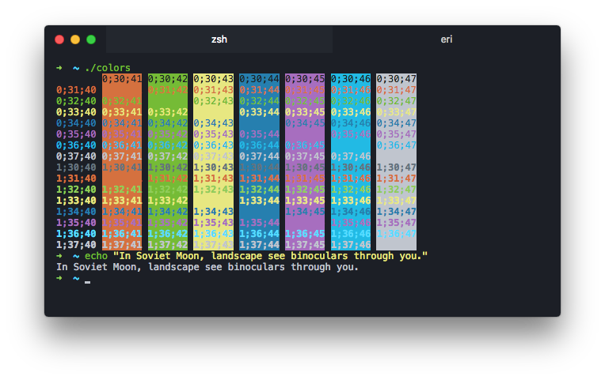

# hyper-darkmatter

Darkmatter theme for [Hyper](https://hyper.is), inspired by [Sublime Darkmatter](https://github.com/patrickemuller/Sublime-Darkmatter-Theme)

## Installation

Just add `hyper-darkmatter` to plugins section in your `~/.hyper.js` config.
